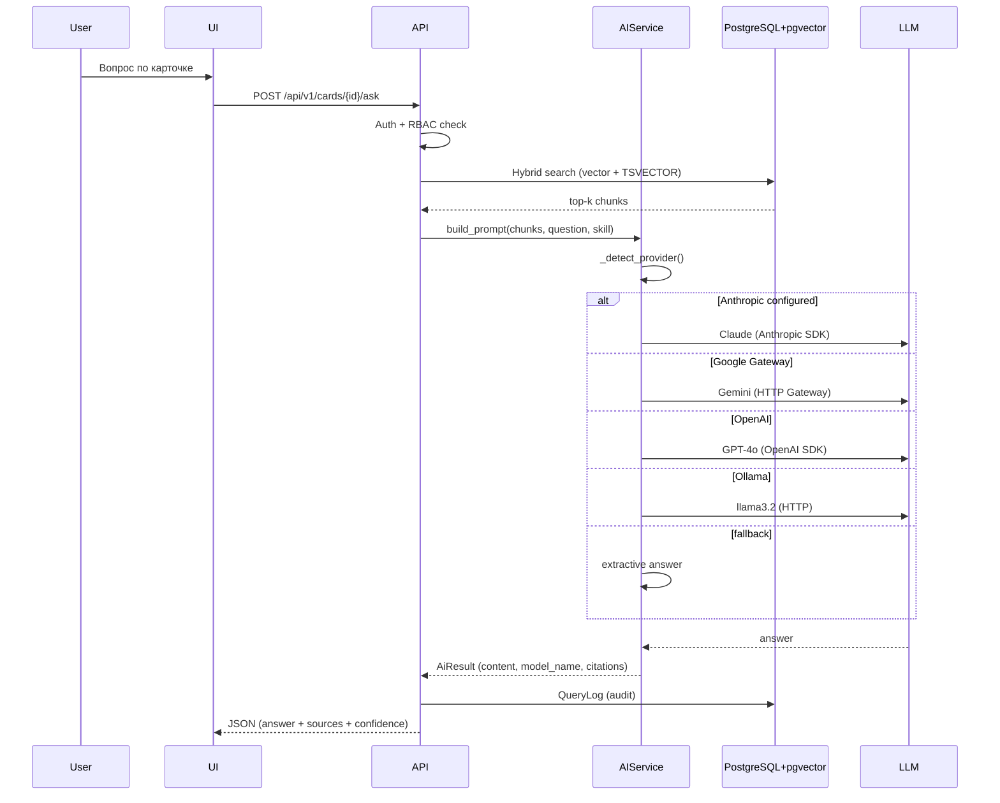
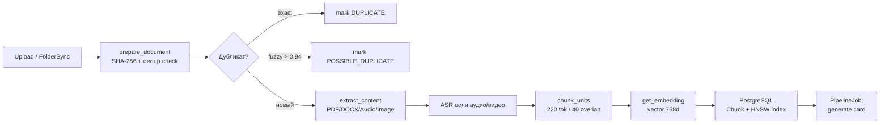

# Архитектура системы

Навигация: [[01_Readme]] | [[06_Модель_данных]] | [[07_Ingestion_ETL]] | [[10_API_контракты]]

> **Версия:** 1.3 | **Обновлено:** 2026-06-19

## Архитектурный обзор

Платформа построена по модульному принципу на стеке **FastAPI + PostgreSQL (pgvector) + React 19**:

- `Experience Layer` — Web UI (React 19 + TypeScript 5.7 + Vite 6 + Zustand 5 + i18next ru/en/kk, собирается в статику).
- `Application Layer` — FastAPI API Gateway, 22 роутера, prefix `/api/v1`.
- `AI Layer` — `AIService` (RAG, генерация, перевод, TTS/STT, image), multi-provider routing.
- `Data Layer` — PostgreSQL 16 + pgvector (метаданные + векторные индексы), объектное хранилище (local / S3).
- `Platform Layer` — auth (demo / SSO), RBAC/ABAC, structlog, PipelineJob очередь.

## Технологический стек (реальный)

| Слой | Технология |
|---|---|
| Backend framework | FastAPI (Python 3.12) |
| База данных | PostgreSQL 16 + расширение pgvector |
| ORM | SQLAlchemy 2.x (Mapped / DeclarativeBase) |
| Векторный индекс | pgvector HNSW (m=16, ef_construction=64, cosine) |
| Полнотекстовый поиск | PostgreSQL TSVECTOR + GIN-индекс |
| Конфигурация | Pydantic Settings + `.env` файл |
| Логирование | structlog (JSON) |
| Frontend | React 19 + TypeScript 5.7 + Vite 6 + Zustand 5 + i18next (SPA, статические файлы) |
| Объектное хранилище | Локальная ФС (default) или S3-совместимое (MinIO / AWS) |
| Фоновые задания | PipelineJob (inline или async worker) |
| AI провайдеры | OpenAI, Anthropic, Google AI Gateway (Gemini), Ollama, fallback extractive |
| Эмбеддинги | OpenAI `text-embedding-3-small`, Google `text-embedding-004`, или hashing (dev) |
| ASR | OpenAI Whisper (`whisper-1`) + опциональный локальный Whisper |
| TTS | OpenAI `gpt-4o-mini-tts` |
| Image generation | DALL-E 3 (OpenAI) / Imagen 3 (Google Gateway) |

## Диаграмма компонентов

```mermaid
graph TD
    U[User / BILife] --> FE[Web UI — React 19 SPA]
    FE --> API[FastAPI — /api/v1]
    API --> AUTH[Auth: demo / SSO + RBAC]
    API --> SEARCH[Search: hybrid vector+keyword]
    API --> CARD[Cards / Artifacts Service]
    API --> CHAT[Chat / QnA / Advisor]
    API --> TOPICS[Topics — Collections]
    API --> STUDIO[Studio — Artifact Generator]
    API --> SPEECH[Speech: TTS / STT / Podcast]
    API --> IMAGES[Image Generation]
    API --> SKILLS[Skills / System Prompts]
    API --> NOTIF[Notifications]
    API --> JOBS[Pipeline Jobs]
    API --> GLOSS[Glossary]
    API --> AUDIT[Audit Log]
    API --> CONN[Connectors — OneDrive/Folder]
    API --> METRICS[Metrics]
    API --> TWIN[Twin — CEO Simulator]
    TWIN --> CEO_LOADER[ceo_loader.py\nlru_cache MD profiles]
    CEO_LOADER --> CEO_FS[(ceo_profiles/*.md\nfile system)]
    TWIN --> AI

    ING[Ingestion Service] --> PROC[Processing Workers — PipelineJob]
    PROC --> EXTRACT[Extraction: PDF/DOCX/PPTX/Audio/Image]
    PROC --> ASR[ASR: Whisper]
    PROC --> EMB[Embeddings Service]
    EXTRACT --> OBJ[(Object Storage\nlocal / S3)]
    EMB --> PG[(PostgreSQL 16\n+ pgvector)]
    PROC --> PG

    SEARCH --> PG
    CARD --> AI[AIService]
    CHAT --> AI
    STUDIO --> AI
    SPEECH --> AI
    AI --> LLM_OAI[OpenAI GPT-4o]
    AI --> LLM_ANT[Anthropic Claude]
    AI --> LLM_GW[Google Gateway\nGemini 2.5 Pro]
    AI --> LLM_OLL[Ollama — local LLM]
    AI --> LLM_FB[Fallback: extractive]
    AI --> PG

    API --> AUDIT
```

## Паттерн данных

- Raw файлы хранятся в объектном хранилище (`storage_uri` в `document_versions`).
- Извлеченный текст разбивается на чанки (max 220 токенов, overlap 40) и индексируется через pgvector HNSW.
- Метаданные и бизнес-сущности — в PostgreSQL (20+ таблиц).
- AI-ответы хранятся как `Artifact` → `ArtifactVersion` с версионированием и цитатами.
- Аудио-транскрипты хранятся как `TranscriptSegment` с таймкодами (start_ms/end_ms).
- Теги, глоссарий, коллекции (Topics) — отдельные нормализованные сущности с M:N связями.

## Ключевые интеграции

- **OneDrive**: источник контента (FOLDER_SYNC / ONEDRIVE коннектор).
- **BILife/SSO**: аутентификация и контекст пользователя (в MVP: `auth_mode=demo`).
- **OpenAI**: LLM (GPT-4o-mini), embeddings (text-embedding-3-small), Whisper, TTS, DALL-E 3.
- **Anthropic**: Claude (claude-sonnet-4-20250514) как альтернативный LLM.
- **Google AI Gateway**: Gemini 2.5 Pro (LLM + VLM), text-embedding-004, Imagen 3.
- **Ollama**: локальный LLM (llama3.2:3b) для offline/air-gap сред.

## Роутеры FastAPI (22 роутера)

| Роутер | Prefix | Назначение |
|---|---|---|
| auth | `/api/v1/auth` | Авторизация, сессии |
| uploads | `/api/v1/uploads` | Загрузка файлов |
| documents | `/api/v1/documents` | CRUD документов, ask, transcript |
| cards | `/api/v1/cards` | Карточки инсайтов, generate, ask |
| artifacts | `/api/v1/artifacts` | Артефакты, dossier, export |
| topics | `/api/v1/topics` | Коллекции, members, documents |
| search | `/api/v1/search` | Гибридный поиск |
| chat | `/api/v1/chat` | Глобальный чат |
| advisor | `/api/v1/advisor` | AI-советник |
| speech | `/api/v1/speech` | TTS, STT, podcast |
| images | `/api/v1/images` | Генерация изображений |
| studio | `/api/v1/studio` | Студия артефактов |
| assets | `/api/v1/assets` | Сгенерированные ассеты |
| tags | `/api/v1/tags` | Теги документов и топиков |
| glossary | `/api/v1/glossary` | Глоссарий терминов |
| notifications | `/api/v1/notifications` | Уведомления |
| jobs | `/api/v1/jobs` | Фоновые задания |
| skills | `/api/v1/skills` | Системные промпты |
| connectors | `/api/v1/connectors` | Коннекторы источников |
| metrics | `/api/v1/metrics` | Метрики использования |
| audit | `/api/v1/audit` | Журнал аудита |
| health | `/api/health` | Health-check |

## Поток запроса Q&A

## Поток Ingestion

## Архитектурные решения

- **Multi-provider AIService**: единый класс с автоматическим определением провайдера по наличию API-ключей; цепочка fallback: Anthropic → Google Gateway → OpenAI → Ollama → extractive.
- **pgvector вместо отдельной VectorDB**: PostgreSQL с HNSW-индексом и GIN для полнотекстового поиска — единая точка хранения метаданных и векторов.
- **PipelineJob очередь**: фоновые задания хранятся в БД, поддерживают retry (3 попытки, exponential backoff), streaming через SSE (`GET /jobs/{id}/stream`).
- **Skills**: системные промпты хранятся в таблице `skills` (БД), не в коде — позволяет менять поведение модели без деплоя.
- **Версионирование артефактов**: каждый язык — отдельная `ArtifactVersion`; перевод выполняется лениво (флаг `translation_pending`).
- **Twin CEO Simulator**: профили CEO хранятся как MD-файлы в `ceo_profiles/` (не в БД и не в коде). `ceo_loader.py` загружает их с `@lru_cache` — правка профилей не требует деплоя, только рестарта процесса (или вызова `reload_profiles()`). Системный промпт собирается динамически из MD-профиля + параметров сектора и сложности.

См. детали: [[07_Ingestion_ETL]], [[08_AI_модуль_RAG]], [[11_Безопасность_и_комплаенс]].
