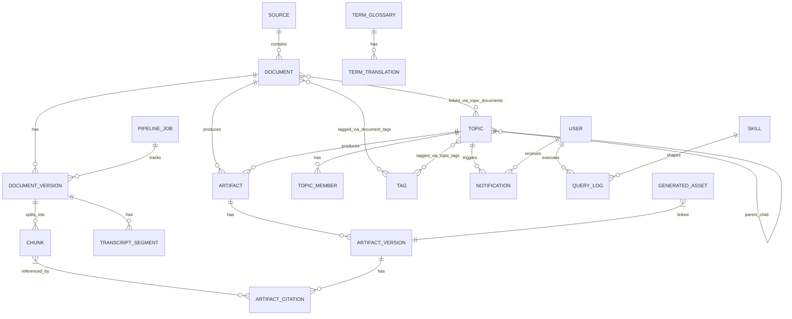

# Модель данных

Навигация: [[01_Readme]] | [[05_Архитектура_системы]] | [[10_API_контракты]] | [[22_Физическая_схема_БД]]

> **Версия:** 1.1 | **Обновлено:** 2026-04-20

## Логическая ER-модель

## Группы сущностей

### 1. Документы и версии

#### `sources`
- `id` (varchar 36, pk, uuid)
- `name` (varchar 255)
- `scope` (enum: INTERNAL / EXTERNAL)
- `kind` (enum: MANUAL / FOLDER_SYNC / ONEDRIVE)
- `root_path` (varchar 1024, nullable)
- `active` (boolean)
- `created_at` (timestamptz)

#### `documents`
- `id` (varchar 36, pk)
- `source_id` (fk → sources)
- `title` (varchar 512)
- `author` (varchar 255, nullable)
- `language` (varchar 8, nullable)
- `content_type` (varchar 32) — pdf / docx / pptx / mp4 / wav / ogg / jpeg / png / …
- `classification` (enum: PUBLIC / INTERNAL / CONFIDENTIAL / RESTRICTED)
- `business_unit` (varchar 64, default "corporate")
- `scope` (enum: INTERNAL / EXTERNAL)
- `access_layer` (varchar 20, default "open")
- `allowed_positions` (jsonb, список должностей)
- `title_i18n` (jsonb, переводы заголовка)
- `created_at`, `updated_at` (timestamptz)

#### `document_versions`
- `id` (varchar 36, pk)
- `document_id` (fk → documents)
- `source_path` (varchar 1024)
- `storage_uri` (varchar 1024)
- `checksum_sha256` (varchar 64) — уникальный вместе с source_path
- `processing_status` (enum: DISCOVERED / QUEUED / PROCESSING / INDEXED / FAILED / QUARANTINED / DUPLICATE)
- `indexed_at` (timestamptz, nullable)
- `page_count` (int, nullable)
- `duration_seconds` (float, nullable) — для аудио/видео
- `source_language` (varchar 8, nullable)
- `extracted_text` (text, nullable)
- `masked_text` (text, nullable) — версия с маскированием PII
- `metadata_json` (jsonb)
- `possible_duplicate` (boolean)
- `duplicate_of_version_id` (fk → document_versions, self-ref)
- `transcription_status` (varchar 32, nullable)
- `tagging_status` (varchar 32, nullable)
- `ai_summary` (text, nullable)
- `index_version` (int, default 1)
- `error_message` (text, nullable)
- `created_at` (timestamptz)

#### `chunks`
- `id` (varchar 36, pk)
- `document_version_id` (fk → document_versions)
- `document_id` (fk → documents)
- `chunk_index` (int)
- `text` (text)
- `section_title` (varchar 255, nullable)
- `page_from`, `page_to` (int, nullable)
- `anchor` (varchar 128) — уникальный идентификатор позиции в документе
- `token_count` (int)
- `language` (varchar 8, nullable)
- `char_offset_start`, `char_offset_end` (int, nullable)
- `embedding_model` (varchar 128, nullable)
- `embedding_version` (int, default 1)
- `embedding` (vector(768)) — pgvector, HNSW-индекс cosine
- `search_vector` (tsvector) — GIN-индекс для keyword search
- `created_at` (timestamptz)

#### `transcript_segments`
- `id` (varchar 36, pk)
- `document_version_id` (fk → document_versions)
- `segment_index` (int)
- `start_ms` (int, nullable) — начало сегмента в мс
- `end_ms` (int, nullable) — конец сегмента в мс
- `speaker` (varchar 64, nullable) — диаризация
- `language` (varchar 8, nullable)
- `anchor` (varchar 128)
- `text` (text)
- `created_at` (timestamptz)

### 2. Артефакты (Artifacts / Cards)

#### `artifacts`
- `id` (varchar 36, pk)
- `document_id` (fk → documents, nullable)
- `topic_id` (fk → topics, nullable) — CHECK: хотя бы одно из двух должно быть заполнено
- `kind` (varchar 32) — card / summary / podcast / flashcard / …
- `status` (varchar 32, default "draft") — draft / ready / published
- `created_at`, `updated_at` (timestamptz)

#### `artifact_versions`
- `id` (varchar 36, pk)
- `artifact_id` (fk → artifacts)
- `language` (varchar 8) — уникально в паре с artifact_id
- `content_json` (jsonb) — структурированное содержание карточки
- `content_text` (text, nullable) — plain text для поиска
- `embedding` (vector(768), nullable)
- `model_name` (varchar 255, nullable)
- `served_language` (varchar 8, nullable)
- `translation_pending` (boolean) — ожидает перевода
- `prompt_version` (varchar 32, nullable)
- `created_at` (timestamptz)

#### `artifact_citations`
- `id` (varchar 36, pk)
- `version_id` (fk → artifact_versions)
- `chunk_id` (varchar 36) — ссылка на chunks.id
- `quote` (text) — цитата из источника
- `anchor` (varchar 128, nullable) — позиция в документе
- `score` (float, nullable) — релевантность

### 3. Коллекции (Topics)

#### `topics`
- `id` (varchar 36, pk)
- `title` (varchar 255)
- `slug` (varchar 255, unique)
- `description` (text, nullable)
- `scope` (enum: INTERNAL / EXTERNAL)
- `business_unit` (varchar 64)
- `liked` (boolean)
- `pinned` (boolean)
- `difficulty` (varchar 32, default "foundation")
- `image_url` (varchar 1024, nullable)
- `parent_id` (fk → topics, self-ref, nullable) — иерархия коллекций
- `owner_email` (varchar 255, nullable)
- `created_at`, `updated_at` (timestamptz)

#### `topic_members`
- `id` (varchar 36, pk)
- `topic_id` (fk → topics, CASCADE DELETE)
- `user_email` (varchar 255)
- `role` (varchar 20) — owner / editor / viewer
- `added_by` (varchar 255)
- `created_at` (timestamptz)

#### `topic_documents`
- `id` (varchar 36, pk)
- `topic_id` (fk → topics)
- `document_id` (fk → documents)
- `is_primary` (boolean)
- `created_at` (timestamptz)

#### `notifications`
- `id` (int, pk, serial)
- `user_email` (varchar 256)
- `type` (varchar 32) — тип уведомления
- `topic_id` (fk → topics, SET NULL on delete, nullable)
- `actor_email` (varchar 256)
- `payload` (text, nullable) — JSON-строка с деталями
- `is_read` (boolean)
- `created_at` (timestamptz)

### 4. Теги

#### `tags`
- `id` (varchar 36, pk)
- `name` (varchar 128)
- `slug` (varchar 128, unique)
- `category` (varchar 64, nullable)
- `color` (varchar 16, nullable)
- `name_en` (varchar 128, nullable)
- `name_kk` (varchar 128, nullable)
- `category_en`, `category_kk` (varchar 64, nullable)
- `created_at` (timestamptz)

#### `topic_tags`
- `id` (varchar 36, pk)
- `topic_id` (fk → topics), `tag_id` (fk → tags) — уникальная пара
- `created_at` (timestamptz)

#### `document_tags`
- `id` (varchar 36, pk)
- `document_id` (fk → documents), `tag_id` (fk → tags) — уникальная пара
- `source` (varchar 32, default "manual") — manual / ai
- `score` (float, default 1.0) — уверенность AI при авто-теггинге
- `created_at` (timestamptz)

### 5. Глоссарий

#### `term_glossary`
- `id` (varchar 36, pk)
- `canonical_term` (varchar 255, unique)
- `notes` (text, nullable)
- `created_at` (timestamptz)

#### `term_translations`
- `id` (varchar 36, pk)
- `glossary_id` (fk → term_glossary)
- `language` (varchar 8) — уникально в паре с glossary_id
- `translated_term` (varchar 255)

### 6. Ассеты и задания

#### `generated_assets`
- `id` (varchar 36, pk)
- `owner_type` (varchar 32) — artifact / topic / document / …
- `owner_id` (varchar 36)
- `kind` (varchar 32) — audio / image / podcast / …
- `status` (varchar 32, default "ready")
- `provider` (varchar 64, nullable) — openai / google / …
- `model_name` (varchar 255, nullable)
- `storage_uri` (varchar 1024, nullable)
- `public_url` (varchar 2048, nullable)
- `mime_type` (varchar 128, nullable)
- `prompt_json` (jsonb)
- `metadata_json` (jsonb)
- `created_at` (timestamptz)

#### `pipeline_jobs`
- `id` (varchar 36, pk)
- `kind` (varchar 32) — тип задания (ingestion, generate_card, …)
- `status` (varchar 32, default "queued") — queued / running / done / failed
- `resource_type` (varchar 32, nullable)
- `resource_id` (varchar 36, nullable)
- `payload_json` (jsonb)
- `result_json` (jsonb)
- `error_message` (text, nullable)
- `attempts` (int, default 0)
- `created_at`, `started_at`, `finished_at` (timestamptz)

### 7. Аудит и Skills

#### `query_logs`
- `id` (varchar 36, pk)
- `user_email` (varchar 255)
- `user_role` (varchar 64)
- `business_unit` (varchar 64)
- `geo` (varchar 32)
- `action` (enum: LOGIN / UPLOAD / FOLDER_SYNC / VIEW_CARD / SEARCH / ASK_CARD / ASK_DOCUMENT / ASK_GLOBAL / GENERATE_CARD / EXPORT / DELETE / UPDATE_GLOSSARY)
- `scope` (varchar 32, nullable)
- `resource_id` (varchar 64, nullable)
- `job_id` (varchar 36, nullable)
- `provider` (varchar 64, nullable) — какой AI-провайдер использован
- `model_name` (varchar 255, nullable)
- `request_json` (jsonb)
- `response_preview` (text, nullable)
- `created_at` (timestamptz)

#### `skills`
- `id` (varchar 36, pk)
- `category` (varchar 20) — mode / position
- `slug` (varchar 60, unique) — например: "modes/expert", "positions/cfo"
- `name` (varchar 120)
- `content` (text) — текст системного промпта
- `version` (int)
- `created_at`, `updated_at` (timestamptz)

## Полный список таблиц (22 таблицы)

| # | Таблица | Группа |
|---|---|---|
| 1 | sources | Документы |
| 2 | documents | Документы |
| 3 | document_versions | Документы |
| 4 | chunks | Документы |
| 5 | transcript_segments | Документы |
| 6 | artifacts | Артефакты |
| 7 | artifact_versions | Артефакты |
| 8 | artifact_citations | Артефакты |
| 9 | topics | Коллекции |
| 10 | topic_members | Коллекции |
| 11 | topic_documents | Коллекции |
| 12 | notifications | Коллекции |
| 13 | tags | Теги |
| 14 | topic_tags | Теги |
| 15 | document_tags | Теги |
| 16 | term_glossary | Глоссарий |
| 17 | term_translations | Глоссарий |
| 18 | generated_assets | Ассеты |
| 19 | pipeline_jobs | Задания |
| 20 | query_logs | Аудит |
| 21 | skills | Skills |

## Версионирование

- Новый файл с иным checksum создаёт новую `document_version`.
- Новая генерация артефакта создаёт `artifact_version` без перезаписи истории.
- Каждый язык артефакта — отдельная `artifact_version` (unique по artifact_id + language).
- API по умолчанию возвращает актуальную версию на запрошенном языке; при отсутствии — возвращает с флагом `translation_pending=true` и текстом на языке-источнике.

## Политика хранения

- Raw и производные артефакты хранятся раздельно (object storage vs DB).
- Для удалений применяется soft-delete через статусы + отложенный purge по retention policy.
- `query_logs` рекомендуется партиционировать по месяцу; ретеншн — 180 дней (по комплаенсу может быть выше).

См. физическую схему: [[22_Физическая_схема_БД]].
