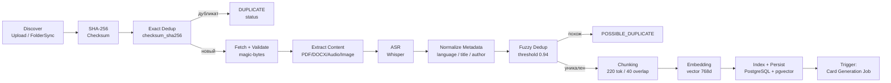

# Ingestion ETL

Навигация: [[01_Readme]] | [[05_Архитектура_системы]] | [[06_Модель_данных]]

> **Версия:** 1.1 | **Обновлено:** 2026-04-20

## Цель модуля

Автоматически превращать загруженные файлы в индексируемые и анализируемые единицы знаний.

## Поддерживаемые источники

- OneDrive connector (FOLDER_SYNC / ONEDRIVE — batch scan + incremental scan).
- Ручной upload через Web UI / API (`POST /api/v1/uploads`).
- Импорт архивов по заданному manifest.

## Поддерживаемые форматы файлов

Реализовано в `services/extraction.py`. Валидация по magic-bytes (сигнатуре файла):

| Категория | Расширения | Метод обработки |
|---|---|---|
| Документы | `.pdf` | Извлечение текста + page anchors |
| Документы | `.docx` | Извлечение текста + section/paragraph anchors |
| Документы | `.pptx` | Извлечение текста по слайдам |
| Документы | `.txt`, `.md` | Прямое чтение |
| Аудио | `.mp3`, `.wav`, `.m4a`, `.ogg`, `.webm` | ASR-транскрибация (Whisper) |
| Видео | `.mp4` | Извлечение аудиодорожки → ASR |
| Изображения | `.jpeg`, `.jpg`, `.png` | VLM-описание (Gemini Vision / GPT-4o) |

Неизвестные расширения пропускаются через magic-byte проверку — разрешены, если сигнатура не определена.

## Стадии pipeline



## Состояния обработки (`ProcessingStatus`)

| Статус | Описание |
|---|---|
| `DISCOVERED` | Файл обнаружен источником |
| `QUEUED` | Поставлен в очередь PipelineJob |
| `PROCESSING` | Активно обрабатывается воркером |
| `INDEXED` | Успешно проиндексирован |
| `FAILED` | Ошибка обработки (см. `error_message`) |
| `QUARANTINED` | Подозрение на нарушение policy |
| `DUPLICATE` | Точный дубликат (по SHA-256 + source_path) |

## Дедупликация

### Точная (primary)

```python
# Уникальный ключ: checksum_sha256 + source_path
if checksum_exists(checksum_sha256, source_path):
    mark_as_duplicate()
    return  # version.processing_status = DUPLICATE
```

Реализовано через `UniqueConstraint("checksum_sha256", "source_path")` в `document_versions`.

### Нечёткая (secondary)

```python
_DEDUP_THRESHOLD = 0.94  # константа в services/ingestion.py

score = possible_duplicate_score(metadata)  # сравнение title + author + duration/pages
if score > _DEDUP_THRESHOLD:
    version.possible_duplicate = True
    version.duplicate_of_version_id = candidate_id
```

Реализовано через `possible_duplicate_score()` в `services/text_utils.py`.

## Параметры чанкинга

Константы определены в `services/ingestion.py`:

```python
_CHUNK_MAX_TOKENS = 220   # максимальный размер чанка в токенах
_CHUNK_OVERLAP    = 40    # перекрытие между соседними чанками
```

### Алгоритм `chunk_units()`

```
1. Разбить документ на ExtractionUnit-ы (параграфы / слайды / speaker-сегменты)
2. Аккумулировать unit-ы в текущий чанк до достижения 220 токенов
3. При достижении лимита: flush() — записать чанк
4. Overlap: перенести хвостовые unit-ы (≥40 токенов) в начало следующего чанка
5. Anchor = первый anchor unit-а (или диапазон first→last для multi-unit чанков)
6. Embedding text = "[HEADER] {section_title}\n{chunk_text}" (если есть заголовок секции)
```

### Метаданные каждого чанка

```yaml
chunk:
  id: varchar(36)              # UUID
  document_version_id: uuid
  document_id: uuid
  chunk_index: int             # порядковый номер в документе
  text: text
  section_title: string|null   # заголовок секции для контекста retrieval
  page_from: int|null
  page_to: int|null
  anchor: varchar(128)         # уникальный идентификатор позиции
  token_count: int
  language: string|null        # ISO 639-1
  char_offset_start: int|null
  char_offset_end: int|null
  embedding_model: string|null
  embedding_version: int       # для переиндексации при смене модели
  embedding: vector(768)       # pgvector, HNSW cosine
  search_vector: tsvector      # GIN-индекс для keyword search
```

## Обработка аудио/видео (ASR)

1. Файл сохраняется в object storage.
2. Запускается транскрибация через OpenAI Whisper (`openai_transcription_model = "whisper-1"`).
3. Опциональный fallback: локальный Whisper (`ENABLE_LOCAL_WHISPER_FALLBACK=true`, модель задаётся `WHISPER_MODEL`).
4. Результат сохраняется в `TranscriptSegment` (start_ms, end_ms, speaker, text, anchor).
5. Транскрипт разбивается на чанки по тем же параметрам (220/40) и индексируется.
6. `document_version.transcription_status` обновляется по завершении.

## Обработка изображений

1. Файл валидируется по magic-bytes (PNG: `\x89PNG`, JPEG: `\xff\xd8\xff`).
2. Описание извлекается через VLM (Vision Language Model):
   - Google Gateway: Gemini Vision (`google_gateway_vlm_model`)
   - OpenAI: GPT-4o (мультимодальный)
3. Описание индексируется как текст документа.

## Обработка ошибок

- Повтор задачи с exponential backoff (3 попытки, 2/4/8 секунд).
- После `N` неудач: статус `FAILED`, `error_message` сохраняется в `document_versions`.
- `QUARANTINED` для файлов с подозрением на policy violation.
- Фоновые задания отслеживаются в `pipeline_jobs` (streaming через SSE: `GET /api/v1/jobs/{id}/stream`).

## Конфигурация

| Параметр | Default | Описание |
|---|---|---|
| `INGESTION_MAX_CONCURRENT` | 3 | Макс. параллельных воркеров |
| `RUN_INLINE_JOBS` | true | Выполнять задания синхронно (false = async worker) |
| `ENABLE_LOCAL_WHISPER_FALLBACK` | false | Локальный Whisper при недоступности OpenAI |
| `WHISPER_MODEL` | small | Размер локальной модели Whisper |
| `EMBEDDING_BACKEND` | hashing | hashing (dev) / openai / google |
| `EMBEDDING_MODEL` | text-embedding-3-small | Модель для embeddings |
| `STORAGE_BACKEND` | local | local / s3 |

## Наблюдаемость ingestion

- latency по каждой стадии (structlog JSON);
- % failed by format;
- queue lag (разница created_at → started_at в pipeline_jobs);
- dedup hit ratio (доля DUPLICATE / POSSIBLE_DUPLICATE среди всех версий);
- transcription_status distribution (для аудио/видео).

См.: [[13_Наблюдаемость_и_SRE]].
