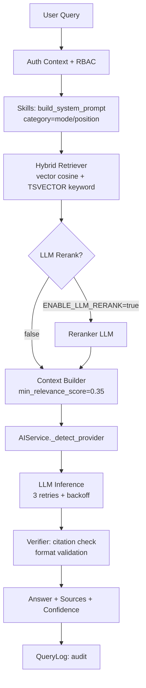

# AI модуль RAG

Навигация: [[01_Readme]] | [[05_Архитектура_системы]] | [[09_Мультиязычность_и_локализация]]

> **Версия:** 1.1 | **Обновлено:** 2026-04-20

## Назначение

AI-модуль (`services/ai/service.py`, класс `AIService`) отвечает за:
- генерацию карточек инсайтов и артефактов (Studio);
- контекстные ответы на вопросы (Q&A по карточке, документу, глобальный чат);
- перевод и локализацию артефактов (TranslationMixin);
- синтез речи TTS и расшифровку STT;
- генерацию изображений;
- контроль качества и объяснимости ответа (citations, groundedness).

## Провайдеры LLM

Реализовано в `_detect_provider()`. Поддерживается несколько провайдеров, выбор — автоматический или явный через `AI_PROVIDER`:

| Провайдер | Конфигурация | Модели |
|---|---|---|
| `anthropic` | `ANTHROPIC_API_KEY` | `claude-sonnet-4-20250514` (настраивается) |
| `gateway` | `GOOGLE_GATEWAY_URL` | Gemini 2.5 Pro (LLM + VLM), Imagen 3 |
| `openai` | `OPENAI_API_KEY` | `gpt-4o-mini` (настраивается), DALL-E 3, Whisper, TTS |
| `ollama` | `OLLAMA_BASE_URL` | `llama3.2:3b` (настраивается) — локальный |
| `fallback` | — | Extractive (без LLM, на основе чанков) |

### Цепочка автоматического выбора провайдера

```
AI_PROVIDER=auto →
  1. ANTHROPIC_API_KEY задан?   → anthropic
  2. GOOGLE_GATEWAY_URL задан?  → gateway
  3. OPENAI_API_KEY задан?      → openai
  4. OLLAMA_BASE_URL доступен?  → ollama
  5. (иначе)                    → fallback (extractive)
```

Явные значения `AI_PROVIDER`: `anthropic`, `gateway`, `openai`, `ollama`, `fallback`.

### Retry-логика

При транзиентных ошибках (rate limit, timeout): 3 попытки с экспоненциальным backoff (2, 4 секунды). Логируется через structlog (`ai.chat`).

### Google Gateway fallback

Если `provider=gateway` и Gateway недоступен — автоматически переключается на OpenAI (если `OPENAI_API_KEY` задан).

## RAG-конвейер



## Параметры чанкинга (исправлено)

Реальные значения из `services/ingestion.py`:

```python
_CHUNK_MAX_TOKENS = 220   # НЕ 512 — реальное значение
_CHUNK_OVERLAP    = 40    # токенов перекрытия между чанками
```

> **Важно:** ранняя документация содержала ошибочные значения 512/64. Фактические параметры — 220 токенов / 40 overlap для всех типов документов. Разбивка единая, адаптируется к семантическим границам (параграф / слайд / speaker-сегмент).

### Embedding text format

```python
# services/ingestion.py, функция _embedding_text()
if section_title:
    return f"[HEADER] {section_title}\n{chunk_text}"
else:
    return chunk_text
```

Размерность вектора: **768** (pgvector, HNSW cosine, m=16, ef_construction=64).

## Шаблон артефакта (карточки инсайта)

```yaml
artifact:
  kind: card | summary | podcast | flashcard   # расширяемый enum
  status: draft | ready | published
  language: ru | en | kk | uz | az
  content_json:                  # структура зависит от kind
    title: string
    executive_summary: string
    core_insight: string
    framework:
      - step: string
        description: string
    actionable_recommendations:
      - item: string
        horizon: [now, quarter, year]
    risks:
      - string
  citations:
    - chunk_id: uuid
      quote: string
      anchor: string
      score: float
```

## Prompt policy

- Нельзя отвечать без источников (если режим `strict_grounded=true`).
- При низкой уверенности AI обязан вернуть `insufficient_evidence`.
- Все промпты версионируются (`prompt_version` в `artifact_versions`).
- Системный промпт формируется динамически через `Skills` (`build_system_prompt()`): категории `mode` (expert, tutor, …) и `position` (по должности сотрудника). Skill-контент хранится в таблице `skills` в БД.
- `MIN_RELEVANCE_SCORE=0.35` — минимальный порог релевантности чанков для включения в контекст.

## Модельный роутинг по задачам

| Задача | Рекомендуемый провайдер | Примечание |
|---|---|---|
| Генерация карточки (сложный синтез) | anthropic / gateway | claude-sonnet / gemini-2.5-pro |
| Q&A по документу | openai / anthropic | gpt-4o-mini достаточно |
| Перевод артефакта | openai / gateway | Лёгкая задача |
| Классификация, теги, language detect | openai / ollama | Можно локально |
| VLM (изображения) | gateway | Gemini Vision / GPT-4o |
| TTS синтез | openai | gpt-4o-mini-tts |
| STT транскрибация | openai | whisper-1 |
| Генерация изображений | gateway / openai | Imagen 3 / DALL-E 3 |
| Offline / air-gap | ollama | llama3.2:3b |

## Мультиязычность и перевод

- Артефакт создаётся на языке-источнике, затем переводится по требованию.
- При запросе на другом языке: если `artifact_version` для языка не существует — запускается перевод и выставляется `translation_pending=true`.
- Поддерживаемые локали: `ru, en, kk, uz, az` (настраивается через `DEFAULT_LOCALES`).
- Глоссарий (`term_glossary`) используется для согласованности терминологии при переводе.

## Речевые возможности (Speech/TTS/STT)

### TTS (синтез речи)
- Модель: `gpt-4o-mini-tts` (OpenAI)
- Голоса: `alloy` (host), `nova` (guest) — для подкастов с диалогом
- Форматы вывода: mp3 (default), настраивается через `OPENAI_TTS_FORMAT`
- Лимит входного текста: `TTS_INPUT_LIMIT` (константа в `services/ai/constants.py`)
- Языковые инструкции: отдельные для каждой локали (`TTS_LANGUAGE_INSTRUCTIONS`)

### STT (транскрибация)
- Модель: `whisper-1` (OpenAI)
- Форматы входа: MP3, WAV, M4A, WEBM, OGG, MP4
- Fallback: локальный Whisper (`ENABLE_LOCAL_WHISPER_FALLBACK=true`)
- Результат: `TranscriptSegment[]` с start_ms / end_ms / speaker / text

### Подкасты
- Генерация диалога двух голосов (host + guest) на основе артефакта
- Хранение в `generated_assets` (kind=podcast, mime_type=audio/mp3)
- Endpoint: `POST /api/v1/speech/podcast/asset` — сохраняет как ассет

## Генерация изображений

- Google Imagen 3 (`google_gateway_image_model = "imagen-3.0-generate-002"`)
- Или DALL-E 3 (`openai_image_model = "dall-e-3"`)
- Flash-режим: быстрая генерация через Gemini Flash (`GOOGLE_GATEWAY_USE_FLASH_IMAGE=true`)
- Endpoint: `POST /api/v1/images/generate`
- Результат сохраняется в `generated_assets`

## Анти-галлюцинационный контур

- Retrieval threshold: `min_relevance_score=0.35` — чанки ниже порога не включаются в контекст.
- Post-check на наличие citations в ответе (при `strict_grounded=true`).
- Запрет фактов, отсутствующих в evidence set.
- Fallback extractive: если LLM недоступен — возвращается топ-чанк без генерации.
- `MASK_EXTERNAL_LLM=true` — маскирование чувствительных данных перед отправкой во внешние LLM.

## Кэширование

- Ключ кэша: `hash(query + card_id + language + prompt_version)`.
- TTL:
  - карточки: `7d`
  - Q&A: `24h`
- Инвалидация при новой версии артефакта.

## Метрики качества

- groundedness (доля ответов с корректными citations);
- citation precision;
- answer helpfulness;
- refusal correctness;
- provider latency (логируется в structlog: `ai.chat`, поле `latency_ms`).

## Переиндексация

При обновлении модели embeddings — полная переиндексация всех чанков (batch job через `pipeline_jobs`).
Триггер: изменение `EMBEDDING_MODEL` или `EMBEDDING_VERSION` в конфиге.

См. также [[14_Тестирование_и_качество]].
