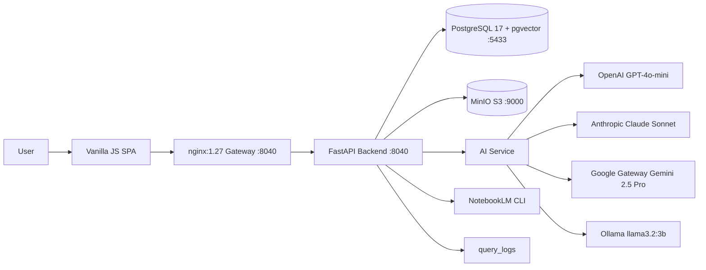

# Threat Model

Навигация: [[01_Readme]] | [[11_Безопасность_и_комплаенс]] | [[24_Runbooks_и_SOP]]

Версия: v1.2 | Дата: 2026-04-20

## Цель

Идентифицировать угрозы по STRIDE и сопоставить контроли до production.

## Data Flow (актуально)



## Компоненты с поверхностью атаки

| Компонент | Порт | Внешний? | Риск |
|---|---|---|---|
| nginx gateway | 8040 | Да | Entry point, rate limit |
| FastAPI backend | 8040 (internal) | Нет | Бизнес-логика, auth |
| PostgreSQL | 5433 (127.0.0.1) | Нет | Данные + векторы |
| MinIO | 9000/9001 (127.0.0.1) | Нет | Файлы документов |
| OpenAI API | external | Да | PII exfiltration |
| Anthropic API | external | Да | PII exfiltration |
| Google Gateway | external | Да | PII exfiltration |
| NotebookLM CLI | subprocess | Нет | Command injection |
| Ollama | localhost:11434 | Нет | Минимальный |

## STRIDE-анализ

| Категория | Угроза | Вектор | Контроль |
|---|---|---|---|
| Spoofing | Подмена пользователя | Demo-mode принимает любые credentials | Короткий TTL + в prod: JWT + BILife SSO |
| Spoofing | Подмена AI-провайдера | Ответ с hallucination | strict_grounded=True + citation check |
| Tampering | Изменение данных | Компрометированный сервис | Audit log в `query_logs` + read-only replicas |
| Tampering | Инъекция в промпт | Пользовательский ввод в LLM context | PII masking + `mask_sensitive_text()` |
| Repudiation | Отрицание действия | Нет доказуемых логов | Immutable `query_logs` + `resource_id` трассировка |
| Information Disclosure | Утечка PII во внешний LLM | `extracted_text` без masking | `MASK_EXTERNAL_LLM=true` + `masked_text` в БД |
| Information Disclosure | Утечка RESTRICTED контента | Обход RBAC | `can_access_document()` + `can_access_by_position()` |
| Information Disclosure | HBS full-text в индексе | EXTERNAL doc в pgvector | EXTERNAL scope → только NotebookLM, no local index |
| Denial of Service | Перегруз API/LLM | Burst traffic | Rate limit nginx + `INGESTION_MAX_CONCURRENT=3` |
| Denial of Service | Длинные LLM-запросы | Большой контекст | Per-endpoint max token caps (см. [[26_FinOps_для_LLM]]) |
| Elevation of Privilege | Обход RBAC | Баг в `can_access_document` | Negative tests (`test_position_access.py`) |
| Elevation of Privilege | folder-sync вне allowed roots | Path traversal | `_allowed_roots` check в `connectors.py` |
| Elevation of Privilege | NotebookLM CLI injection | Пользовательский input в subprocess | Параметры передаются через список (не shell=True) |

## Приоритетные риски

1. **КРИТИЧЕСКИЙ**: Утечка чувствительных данных (PII, CONFIDENTIAL) во внешний LLM без masking.
2. **ВЫСОКИЙ**: Несанкционированный доступ к RESTRICTED-контенту (обход RBAC/ABAC).
3. **ВЫСОКИЙ**: HBS-контент (EXTERNAL scope) попадает в локальный pgvector индекс.
4. **СРЕДНИЙ**: Supply-chain уязвимости в зависимостях (26 пакетов в `pyproject.toml`).
5. **СРЕДНИЙ**: Demo-mode (`AUTH_MODE=demo`) включён в production.

## Обязательные контроли до go-live

```text
[ ] PII masking включён (MASK_EXTERNAL_LLM=true) и протестирован
[ ] RBAC/ABAC policy tests покрывают негативные сценарии (test_position_access.py)
[ ] AUTH_MODE переключён с demo на prod (BILife SSO/JWT)
[ ] Secret rotation и KMS проверены (OPENAI_API_KEY, ANTHROPIC_API_KEY, DB_PASSWORD)
[ ] Audit log (query_logs) неизменяемый и доступен Security
[ ] WAF/rate limits настроены на nginx gateway
[ ] EXTERNAL scope документы не попадают в chunks/embeddings
[ ] MinIO и PostgreSQL не доступны извне (только 127.0.0.1 binding)
[ ] Dependency scan пройден (0 critical CVE)
```

## Обновление модели угроз

Модель пересматривается при:
- добавлении нового AI-провайдера;
- изменении auth-механизма;
- включении нового внешнего интегратора;
- go-live каждой новой волны пользователей.
