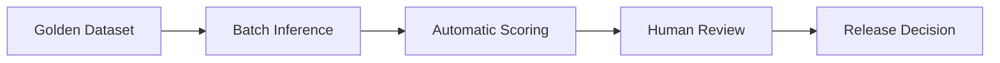

# AI Governance и Evaluation

Навигация: [[01_Readme]] | [[08_AI_модуль_RAG]] | [[14_Тестирование_и_качество]]

Версия: v1.2 | Дата: 2026-04-20

## Scope

Документ определяет правила управления AI-качеством, безопасностью моделей и governance процессом для платформы BI AQYL.

## AI-провайдеры и модели (актуально)

| Провайдер | Модель | Назначение | Config key |
|---|---|---|---|
| OpenAI | gpt-4o-mini | Основная LLM (chat, cards, Q&A) | `OPENAI_MODEL` |
| OpenAI | whisper-1 | ASR транскрипция аудио | `OPENAI_TRANSCRIPTION_MODEL` |
| OpenAI | gpt-4o-mini-tts | Text-to-Speech | `OPENAI_TTS_MODEL` |
| OpenAI | dall-e-3 | Image generation | `OPENAI_IMAGE_MODEL` |
| OpenAI | text-embedding-3-small | Embedding | `EMBEDDING_MODEL` |
| Anthropic | claude-sonnet-4-20250514 | Fallback LLM | `ANTHROPIC_MODEL` |
| Google Gateway | gemini-2.5-pro | LLM + VLM fallback | `GOOGLE_GATEWAY_LLM_MODEL` |
| Google Gateway | text-embedding-004 | Embedding (Google) | `GOOGLE_GATEWAY_EMBED_MODEL` |
| Google Gateway | imagen-3.0-generate-002 | Image generation | `GOOGLE_GATEWAY_IMAGE_MODEL` |
| Ollama | llama3.2:3b | Local fallback LLM | `OLLAMA_MODEL` |
| NotebookLM | — | EXTERNAL scope artifacts | `NOTEBOOKLM_NOTEBOOK_ID` |

## Model Registry

Для каждой модели/версии фиксируются:
- назначение (chat / summarization / qna / translation / embedding / asr / tts / image);
- latency/cost profile;
- разрешённые типы данных (INTERNAL / EXTERNAL);
- дата валидации и owner.

Маскирование: `MASK_EXTERNAL_LLM=true` (default) — PII удаляется до передачи в облачные LLM. EXTERNAL scope HBS обрабатывается **только через NotebookLM** (browser automation, не прямой API).

## Prompt Registry

- Каждый prompt имеет `prompt_id` и `prompt_version` (поле `prompt_version` в `artifact_versions`).
- Промпты хранятся в `backend/guidelines/` и `backend/skills/`.
- Таблица `skills` в БД: category (`mode` / `position`), slug, content, version.
- Изменение prompt только через review (PR + AI Team sign-off).
- Regression eval обязателен при каждом изменении prompt.

## Evaluation pipeline



Golden Dataset: минимум 200 вопросов по реальным кейсам (статус OI-011 — в работе, планируется в `tests/golden/`).

## Метрики качества AI

| Метрика | Цель | Как измеряется |
|---|---|---|
| Groundedness | Высокая | Доля ответов со ссылками на chunks |
| Citation precision/recall | precision >= 0.9 | Сверка цитат с artifact_citations |
| Hallucination rate | Минимальная | Human review на golden dataset |
| Helpfulness | >= 4.2/5 | Пользовательские оценки |
| Refusal correctness | Высокая | Тесты на insufficient_evidence |
| Min relevance score | >= 0.35 | Косинусное сходство чанков (MIN_RELEVANCE_SCORE) |

## Режимы ответа (Skills / Modes)

Реализованы через таблицу `skills` и `backend/guidelines/`:
- `strict_grounded` — только из найденных chunks (default).
- `creative` — допускает выводы за пределами контекста.
- Position-based modes: gd, pm, pto, legal, hr, finance, employee.

Тесты: `test_answer_modes.py`, `test_skills_api.py`, `test_skills_service.py`.

## Red Teaming

- Prompt injection tests (пользовательский input в system context).
- Data exfiltration tests (PII в ответе LLM).
- Jailbreak robustness checks.
- RBAC bypass tests (`test_position_access.py`).
- Path traversal в folder-sync (`connectors.py` — `_allowed_roots` check).

## Release gates для AI

```text
[ ] Hallucination rate <= целевого порога
[ ] Citation coverage >= 95%
[ ] Нет critical policy violations
[ ] Human review sign-off получен
[ ] Regression eval на golden dataset пройден
[ ] Все prompt_version обновлены в artifact_versions
[ ] MASK_EXTERNAL_LLM=true проверен
```

## Governance процесс изменения модели

1. Добавить модель в Model Registry (таблица документации).
2. Прописать env-переменную в `config.py`.
3. Добавить в fallback chain (`ai_provider=auto`).
4. Провести regression eval (batch inference на golden dataset).
5. Получить sign-off AI Team.
6. Создать ADR если это архитектурное изменение.
7. Обновить `25_AI_Governance_и_Evaluation.md`.
