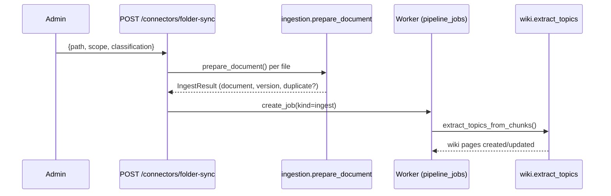

# Интеграции и контракты

Навигация: [[01_Readme]] | [[21_OpenAPI_и_версионирование]] | [[24_Runbooks_и_SOP]]

Версия: v1.2 | Дата: 2026-04-20

## Интеграции (актуально)

| Интеграция | Статус | Назначение |
|---|---|---|
| OpenAI API | Реализована | GPT-4o-mini (chat/cards), Whisper (ASR), TTS, DALL-E 3 |
| Anthropic API | Реализована | Claude Sonnet (fallback LLM) |
| Google AI Gateway | Реализована | Gemini 2.5 Pro (LLM/VLM), Imagen 3 (images), text-embedding-004 |
| Ollama | Реализована | llama3.2:3b (local fallback, localhost:11434) |
| NotebookLM | Реализована | EXTERNAL scope: quiz/report/podcast/slides (CLI через subprocess) |
| MinIO / S3 | Реализована | Object storage для файлов (aiobotocore + boto3) |
| PostgreSQL + pgvector | Реализована | Основная БД + векторный индекс |
| OneDrive (connector) | Частичная | folder-sync через `POST /api/v1/connectors/folder-sync` |
| BILife / SSO | Не реализована | Планируется Фаза 3 (JWT, HTTP 501 сейчас) |

## Контракт: Google AI Gateway

Реализован в `backend/services/gateway.py` (`GatewayClient`):

| Метод | Path | Описание |
|---|---|---|
| POST | `{GOOGLE_GATEWAY_URL}/llm` | LLM запрос (model, input, temperature, max_output_tokens) |
| POST | `{GOOGLE_GATEWAY_URL}/vlm` | VLM анализ файла (prompt, model, file multipart) |
| POST | `{GOOGLE_GATEWAY_URL}/embed` | Embedding текста |
| POST | `{GOOGLE_GATEWAY_URL}/image` | Генерация изображения |
| POST | `{GOOGLE_GATEWAY_URL}/transcribe` | ASR транскрипция |

Timeout: `GOOGLE_GATEWAY_TIMEOUT_SECONDS=120` (default). Fallback: `USE_FLASH_IMAGE=true`.

## Контракт: NotebookLM

Реализован в `backend/services/notebooklm.py` (`NotebookLMService`):

| Метод | Описание | Timeout |
|---|---|---|
| `generate_quiz(description)` | Генерация теста (JSON → SCHEMA_TEST) | 360s |
| `generate_report(description)` | Генерация репорта (Markdown → SCHEMA_REPORT) | 360s |
| `generate_podcast(description)` | Генерация подкаста (→ mp3 bytes) | 600s |
| `generate_slides(description)` | Генерация слайдов (→ pptx bytes) | 360s |

- Вызов: subprocess `python -m notebooklm ...` (не shell=True, безопасно).
- Notebook ID: `72c8f1f7` (из `NOTEBOOKLM_NOTEBOOK_ID`).
- Python path: `NOTEBOOKLM_PYTHON=/opt/homebrew/bin/python3.10`.
- Используется **только для EXTERNAL scope** документов (HBS).
- Graceful fallback: `get_notebooklm_service()` возвращает `None` если не настроен.

## Контракт: OneDrive / Folder Sync

Реализован в `backend/api/routers/connectors.py`:

- Режим: `POST /api/v1/connectors/folder-sync` (только для `admin`).
- Рекурсивное сканирование папки (`path.rglob("*")`).
- Фильтрация по `SUPPORTED_EXTENSIONS` (pdf, docx, pptx, mp3, png, ...).
- Security: `_allowed_roots = [/data, /app/data, ~/Documents]` — path traversal защита.
- Идемпотентность по `checksum_sha256` + `source_path` (UNIQUE constraint).
- Дубликаты: `rapidfuzz` fuzzy matching, threshold 0.94.

## Контракт: SSO/BILife claims

Обязательные claims в JWT (план Фаза 3):
- `sub` — идентификатор пользователя
- `email` — email пользователя
- `roles` — роль (viewer/editor/owner/admin)
- `business_unit` — подразделение
- `geo` — регион (kz, ru, uz, az, ...)

Текущая реализация (`UserContext` в `security.py`): email, role, business_unit, geo, position, language.

## Retry/Timeout policy

| Интеграция | Timeout | Retry | Backoff |
|---|---:|---:|---|
| OpenAI API | 30s | 2 | linear |
| Anthropic API | 30s | 2 | linear |
| Google Gateway LLM | 120s | 1 | — |
| Google Gateway Image | 120s | 1 | — |
| Ollama | 60s | 1 | — |
| NotebookLM quiz/report | 360s | 0 | — |
| NotebookLM podcast | 600s | 0 | — |
| OneDrive / folder scan | 10s | 5 | exponential + jitter |
| SSO introspection | 3s | 2 | exponential |
| MinIO/S3 | 30s | 3 | exponential |
| PostgreSQL | pool timeout 5s | — | — |

## Circuit breaker

- Открывать circuit при >50% ошибок за rolling window 60s.
- В degraded mode:
  - Отключать тяжёлые AI-фичи (image generation, TTS, wiki lint).
  - Оставлять поиск и карточки последней версии.
  - NotebookLM — отключать отдельно (P3 severity).

## Сценарий синхронизации (folder-sync)

